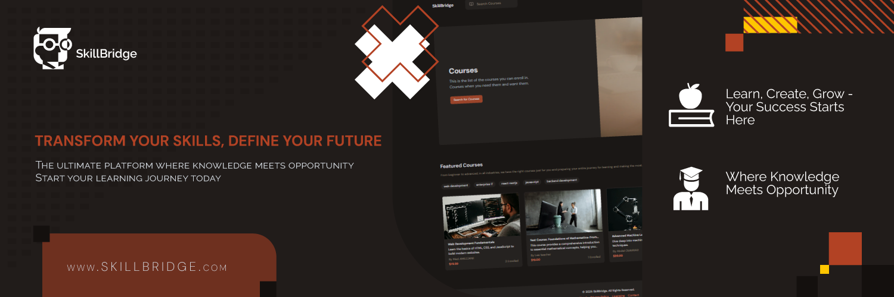
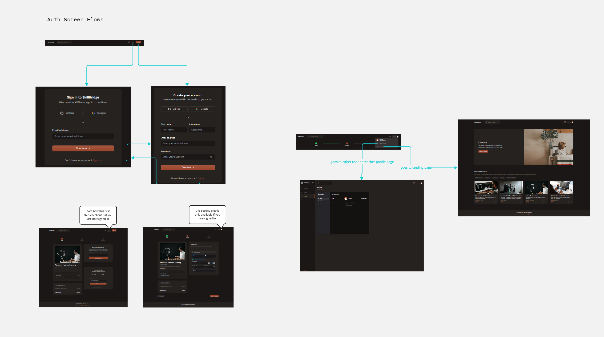
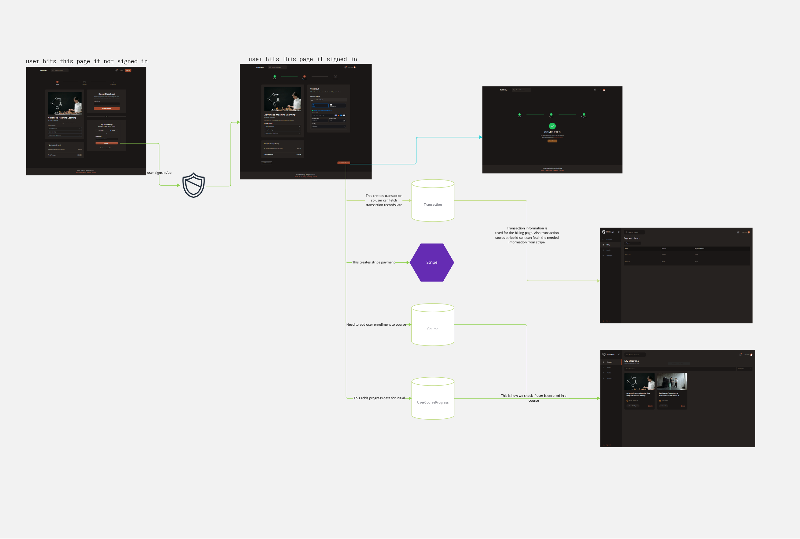
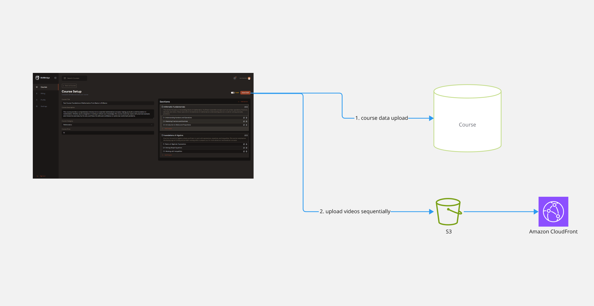
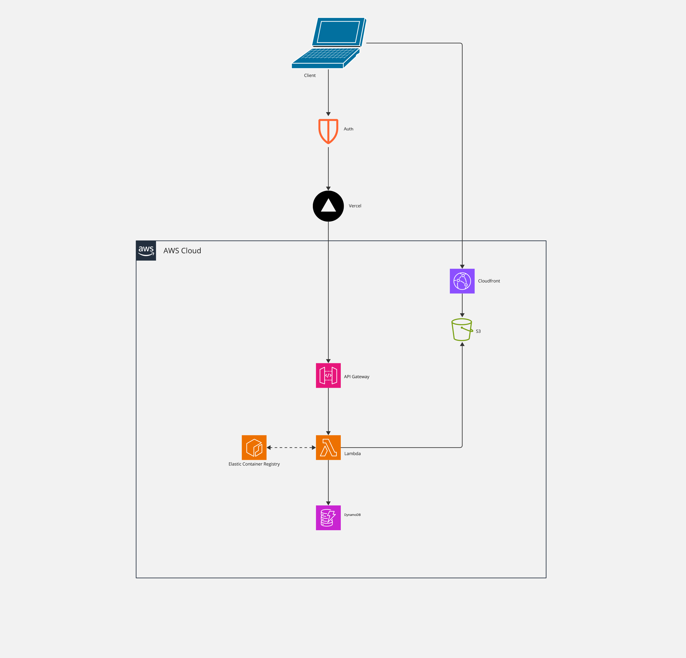
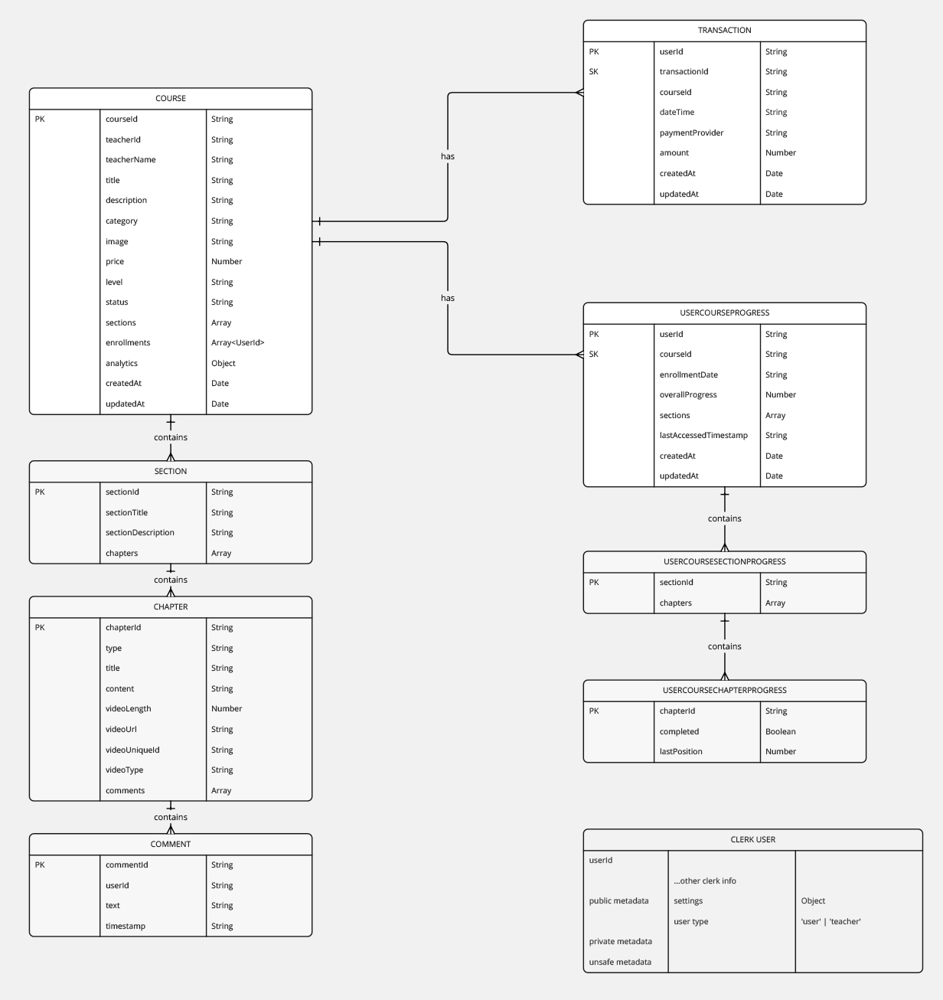
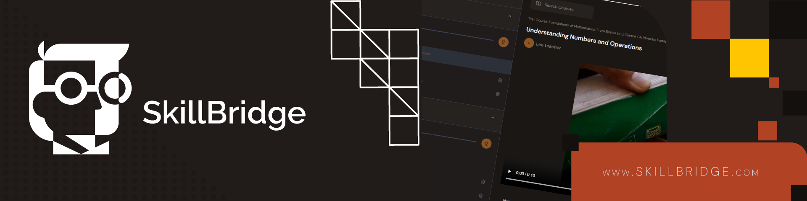

<div align="center">
  <h1 align="center">SkillBridge - Modern E-Learning Platform 🎓
</h1>

   <div align="center">
     A robust e-learning platform built with modern technologies, offering seamless course creation, management, and learning experiences.
     
  
    </div>
</div>


# 📑 Table of Contents

- [Introduction](#introduction)
- [Tech Stack](#tech-stack)
- [Architecture](#architecture)
- [Features](#features)
- [Live Demo](#live-demo)
- [Quick Start](#quick-start)
- [Contributing](#contributing)
- [License](#license)

# <a name="introduction">🤖 Introduction</a>

SkillBridge is a cutting-edge e-learning platform designed to bridge the gap between learners and educators. Built with scalability and performance in mind, it leverages modern web technologies and cloud infrastructure to deliver a seamless learning experience.

# <a name="tech-stack">⚙️ Tech Stack</a>

## Frontend
- **Core Framework**: Next.js with TypeScript
- **State Management**: Redux Toolkit for global state
- **API Communication**: RTK Query for efficient data fetching
- **UI/UX**: 
 - Tailwind CSS for styling
 - shadcn/ui for component library
 - Framer Motion for fluid animations
- **Form Handling**: 
 - React Hook Form for performance
 - Zod for robust validation
- **Authentication**: Clerk for secure user management
- **Payments**: Stripe integration for secure transactions

## Backend 
- **Runtime Environment**: Node.js
- **API Framework**: Express.js
- **Data Layer**: 
 - DynamoDB for NoSQL database
 - Dynamoose as ODM for schema management
- **File Handling**: 
 - Multer for file upload processing
 - Amazon S3 for file storage
- **Content Delivery**: CloudFront CDN
- **Containerization**: Docker

## Cloud & DevOps
- **Container Management**: Amazon ECR
- **Serverless Computing**: AWS Lambda
- **API Gateway**: Request routing and management
- **Frontend Deployment**: Vercel
  
# <a name="architecture">🔄 System Architecture & Flows</a> 

## Application Flows

### Authentication Flow

Our authentication system leverages Clerk for secure user management, implementing a robust multi-step verification process

### Checkout Flow

Seamless payment processing integration with Stripe

### Course Editor Flow

Intuitive course creation and management system

## Infrastructure Architecture

### AWS Architecture Diagram

Our cloud infrastructure is built on AWS, utilizing:
- Serverless computing with Lambda
- Content delivery through CloudFront
- S3 for media storage
- API Gateway for request handling
- DynamoDB for data persistence

## Database Design

### Entity Relationship Diagram

Our database architecture is designed for scalability and performance

### Database Schema
```markdown
**Section Schema**
  - `sectionId`
  - `sectionTitle`
  - `sectionDescription`
  - `chapters`: Array of chapter details

- **Chapter Schema**
  - `chapterId`
  - `type`: Content type (Text/Quiz/Video)
  - `title`
  - `content`
  - `comments`: User comments
  - `video`: Optional video URL
  
// Additional schemas available in .\assets\docs\schema.md
```

## <a name="features">🔋 Features</a>

### User Authentication & Management
- 🔐 **Secure Authentication**
 - Comprehensive Clerk-powered authentication system
 - Email verification process with robust validation
 - Multi-tier user role management (Teachers and Learners)
 - Advanced profile security controls

### Course Creation & Management
- 🎓 **Powerful Course Development Tools**
 - Intuitive drag-and-drop course editor
 - Flexible section and chapter organization
 - Direct video upload with Amazon S3 integration
 - Comprehensive draft and publish workflow
 - Easy course editing and deletion capabilities

### Payment & Enrollment
- 💳 **Seamless Transaction Management**
 - Stripe-powered secure checkout process
 - Multiple payment method support
 - Guest and registered user enrollment
 - Transparent billing history
 - One-click course acquisition


### Technical Innovations
 - 📱 **Responsive cross-device design**
 - High-performance video streaming
 - Real-time progress synchronization
 - Serverless architecture with AWS Lambda
 - Docker containerization for consistent deployment
 - Global content delivery via CloudFront CDN

# <a name="live-demo">🚀 Live Demo</a>

### Platform Access
- **Demo Site**: [SkillBridge Platform](https://skill-bridge-v1-0.vercel.app/)

### Test Accounts

#### Instructor Account
- **Email**: `instructor@skillbridge.com`
- **Password**: `TeacherDemo2025!`
- **Permissions**: Course creation, content management

#### Learner Account
- **Email**: `learner@skillbridge.com`
- **Password**: `StudentDemo2025!`
- **Permissions**: Course enrollment, learning progression

### Stripe Test Payment Details
- **Card Number**: `4242 4242 4242 4242`
- **Expiration**: Any future date
- **CVV**: Any 3-digit number
- **Postal Code**: Any valid postal code

### Demo Walkthrough
1. Visit the live demo site
2. Log in with either test account
3. Explore platform features corresponding to account type

# <a name="quick-start">🤸 Quick Start</a>

Follow these steps to set up the project locally on your machine.

### **Prerequisites**

Make sure you have the following installed on your machine:

- [Git](https://git-scm.com/)
- [Node.js](https://nodejs.org/en)
- [npm](https://www.npmjs.com/) (Node Package Manager)

### **Cloning the Repository**

```bash
git clone https://github.com/MedAMEZZANE/skillbridge.git
cd skillbridge
```

### **Installation**

Install the project dependencies using npm:

```bash
npm install
```

### **Set Up Environment Variables**

Change the file named `.env.example` to `.env` in ./server and `.env.example` to  `.env.local` in ./client and add your keys.

### **Running the Project**

```bash
npm run dev
```

Open [http://localhost:3000](http://localhost:3000) in your browser to view the project.

# <a name="snippets">🕸️ Code & Snippets</a>

### 🚀 API Configuration Highlights

<details>

```typescript
// Advanced RTK Query Custom Base Query
const customBaseQuery = async (args, api, extraOptions) => {
 // Key Features:
 // ✅ Automatic Clerk authentication
 // ✅ Dynamic error handling
 // ✅ Toast notifications
 // ✅ Intelligent response transformation
}

// Core API Endpoint Structure
export const api = createApi({
 tagTypes: [
   "Courses", 
   "Users", 
   "UserCourseProgress"
 ],
 endpoints: (build) => ({
   // Course Management
   createCourse: build.mutation<Course, {
     teacherId: string;
     teacherName: string;
   }>({...}),
   
   // Payment Integration
   createStripePaymentIntent: build.mutation
     { clientSecret: string }, 
     { amount: number }
   >({...}),
   
   // User Progress Tracking
   updateUserCourseProgress: build.mutation
     UserCourseProgress, 
     {
       userId: string;
       courseId: string;
       progressData: {
         sections: SectionProgress[];
       };
     }
   >({...})
 })
})
```
</details>

### 📦 Docker Configuration

<details>

```dockerfile
# Use the AWS Lambda Node.js 20 base image
FROM public.ecr.aws/lambda/nodejs:20 AS build

# Set the working directory
WORKDIR /app

# Copy package.json and package-lock.json
COPY package*.json ./

# Install dependencies (including dev dependencies for building)
RUN npm install

# Copy the rest of your application's source code
COPY . .

# Build TypeScript files
RUN npm run build

# Remove dev dependencies
RUN npm prune --production

# Use a second stage to prepare the production image
FROM public.ecr.aws/lambda/nodejs:20

# Set the working directory
WORKDIR ${LAMBDA_TASK_ROOT}

# Copy built JavaScript files and node_modules from the build stage
COPY --from=build /app/dist ${LAMBDA_TASK_ROOT}
COPY --from=build /app/node_modules ${LAMBDA_TASK_ROOT}/node_modules

# Copy package.json (optional)
COPY --from=build /app/package*.json ${LAMBDA_TASK_ROOT}

# Set environment variables (adjust as needed)
ENV NODE_ENV=production

# Command to start the Lambda function
CMD ["index.handler"]
```
</details>


# <a name="contributing">🤝 Contributing</a>

We welcome contributions from the community to make SkillBridge even better! To contribute:
1. Fork the repository.
2. Create a new branch for your feature or bug fix:
   ```bash
   git checkout -b feature-name
   ```
3. Commit your changes:
   ```bash
   git commit -m "Add your commit message here"
   ```
4. Push the branch to your fork:
   ```bash
   git push origin feature-name
   ```
5. Open a pull request to the main repository.

Please ensure your code adheres to our coding standards and is thoroughly tested.

---


# <a name="license">📝 License</a>

You are welcome to explore, modify, and share this project under the terms of the MIT License. While attribution is not required, we would greatly appreciate crediting the original creators for their efforts.

---

<div align="center">

 

</div>

<p align="center">
Built with ❤️ by the SkillBridge Team
</p>